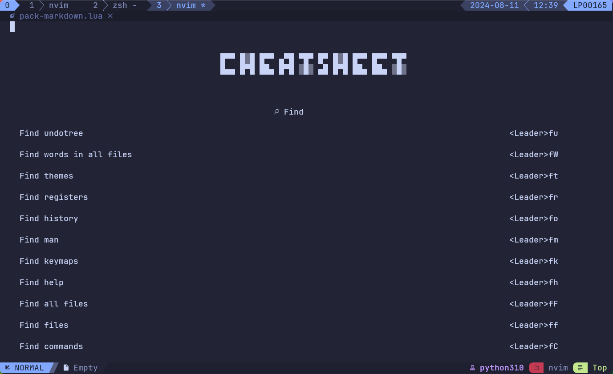

# 🚀 AstroNvimV5 Configuration

Welcome to my customized AstroNvimV5 configuration! This setup has been optimized for an efficient and powerful development workflow. Below, you'll find all the details on how to install, configure, and use this setup, along with some helpful tips and tricks.

---

## ✨ Overview

In my daily tasks, I've streamlined my workflow by integrating several powerful tools:

- **Terminal**: I use `Kitty` for its blend of performance and rich features.
- **Session Management**: `tmux` helps me manage multiple terminal sessions within a single window.
- **File Manager**: `yazi` is my terminal-based file manager, fitting seamlessly into my terminal-centric workflow.

Additionally, this configuration is compatible with `neovide`, so no extra setup is required.

This combination of tools significantly enhances my productivity, providing a robust and efficient terminal experience.

---

## 🔧 Features

This configuration supports development in the following languages:

- **TypeScript**: Using `vtsls` with `volar2`.
- **Python**: `basedpyright` is the LSP of choice.
- **Go**: With `gopher.nvim`, supporting the Go Zero framework.
- **Rust**: Powered by `mrcjkb/rustaceanvim`.
- **Markdown**: Integrated with `iamcco/markdown-preview.nvim`.

---

## 🛠️ Installation

### 1. Install Lua 5.1

Neovim requires LuaJIT, so Lua 5.1 is currently the best version to use. [Why Neovim uses Lua 5.1](https://neovim.io/doc/user/lua.html).

#### Install Luarocks

```bash
wget https://luarocks.github.io/luarocks/releases/luarocks-3.11.1.tar.gz
tar zxpf luarocks-3.11.1.tar.gz
cd luarocks-3.11.1

./configure --lua-version=5.1 --lua-suffix=5.1
make
sudo make install

luarocks --version
```

#### Install Lua 5.1

```bash
wget https://www.lua.org/ftp/lua-5.1.5.tar.gz
tar zxpf lua-5.1.5.tar.gz
cd lua-5.1.5

# For macOS
make macosx

make test
sudo make install

which lua
lua -v
```

### 2. Ensure System Commands Are Available

Make sure the following commands are installed on your system:

- `npm`
- `rustc`
- `go`
- `tmux`

### 3. Install Dependencies

Use `brew`, `npm`, and `pip` to install the necessary dependencies:

```bash
# Homebrew packages
brew install fzf fd lazygit ripgrep gdu bottom protobuf gnu-sed mercurial ast-grep lazydocker

# Node.js packages
npm install -g tree-sitter-cli neovim @styled/typescript-styled-plugin

# Python packages
pip install pynvim pylatexenc
```

### 4. Install AstroNvim

Backup your existing Neovim configuration and clone the customized AstroNvim setup:

```bash
mv ~/.config/nvim ~/.config/nvim.bak
rm -rf ~/.local/share/nvim
rm -rf ~/.local/state/nvim
rm -rf ~/.cache/nvim

# Clone the customized AstroNvim configuration
git clone https://github.com/chaozwn/astronvim_with_coc_or_mason ~/.config/nvim
```

---

## 🖥️ Workflow Screenshots

Here are some screenshots showcasing the workflow with `kitty`, `tmux`, `yazi`, and AstroNvim.

### Kitty + tmux + AstroNvim


### Kitty


### tmux


### yazi


---

## 🔗 Other Configurations

- **Kitty**: [https://github.com/chaozwn/kitty](https://github.com/chaozwn/kitty)
- **tmux**: [https://github.com/chaozwn/tmux](https://github.com/chaozwn/tmux)
- **yazi**: [https://github.com/chaozwn/yazi](https://github.com/chaozwn/yazi)

---

## 🦀 Rust Development Note

When working with Rust, note that `rustup` and `mason` install `rust-analyzer` differently, which may cause some [bugs](https://github.com/rust-lang/rust-analyzer/issues/17289). Manual installation is recommended:

```bash
rustup component add rust-analyzer
```

---

## 💡 Tips & Tricks

### NVcheatsheet

Press `<F2>` to open the NVcheatsheet.



### Use Lazygit

Trigger command: `<leader>tl`


### Install Bottom

Trigger command: `<Leader>tt`

```bash
brew install bottom
```


### Neovim Requirements

Ensure Neovim dependencies are installed

```bash
# Install Neovim dependencies
npm install -g neovim
pip install pynvim
```

### Markdown Image Paste

To enable image pasting in Markdown files, install the `pillow` Python package:

```bash
pip install pillow
```

### Input Method Auto Switch

To automatically switch input methods when entering and exiting insert mode in Neovim:

1. Install `im-select`:

   ```bash
   brew tap laishulu/macism
   brew install macism
   ```

2. Run `im-select` and copy the result to your `im-select.lua` configuration:

   ```bash
   macism
   ```

3. Add the following configuration to your `im-select.lua` file:

   ```lua
   return {
       "chaozwn/im-select.nvim",
       lazy = false,
       opts = {
           default_command = "macism",
           default_main_select = "im.rime.inputmethod.Squirrel.Hans",
           set_previous_events = { "InsertEnter", "FocusLost" },
       },
   }
   ```

### Optional Input Method

For an alternative input method, you can install `squirrel`:

```bash
brew install --cask squirrel
```

---

## 🎛️ General Mappings

Here are the general key mappings for this configuration:

| Action                          | Keybinding          |
| ------------------------------- | ------------------- |
| **Leader key**                  | `Space`             |
| **Resize up**                   | `Ctrl + Up`         |
| **Resize down**                 | `Ctrl + Down`       |
| **Resize left**                 | `Ctrl + Left`       |
| **Resize right**                | `Ctrl + Right`      |
| **Move to upper window**        | `Ctrl + k`          |
| **Move to lower window**        | `Ctrl + j`          |
| **Move to left window**         | `Ctrl + h`          |
| **Move to right window**        | `Ctrl + l`          |
| **Force write**                 | `Ctrl + s`          |
| **Force quit**                  | `Ctrl + q`          |
| **New file**                    | `Leader + n`        |
| **Close buffer**                | `Leader + c`        |
| **Next tab (real Vim tab)**     | `]t`                |
| **Previous tab (real Vim tab)** | `[t`                |
| **Toggle comment**              | `Leader + /`        |
| **Horizontal split**            | `\`                 |
| **Vertical split**              | <code>&#124;</code> |

---

## 📝 Notes

### LSP Hover Information

You can use `vim.lsp.buf.hover()` to display hover information about the symbol under the cursor in a floating window. Calling the function twice will jump into the floating window.

- **Keybinding**: `KK`

### Setting DAP Breakpoints

To quickly set a DAP (Debug Adapter Protocol) breakpoint, use `<Ctrl-LeftClick>` on the line number.

---

## 🧑‍💻 Supported Neovim Version

This configuration supports Neovim version `>= 0.10`.

---

## 📝 License

This configuration is open-source and available under the [MIT License](https://opensource.org/licenses/MIT).

---

Feel free to explore, customize, and enjoy this powerful Neovim setup! If you have any questions or encounter issues, don't hesitate to reach out.

Happy coding! 🚀

---
