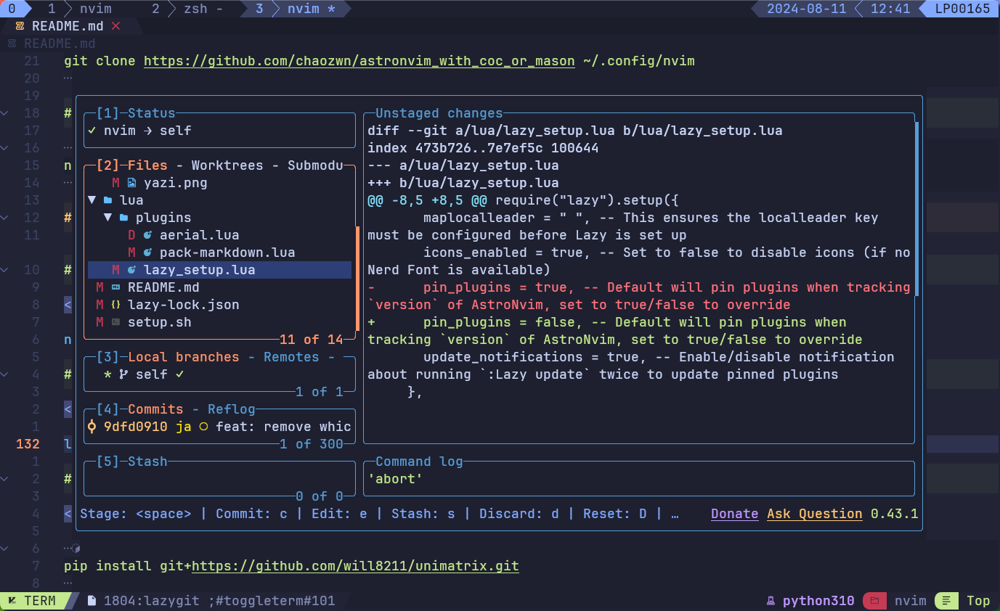
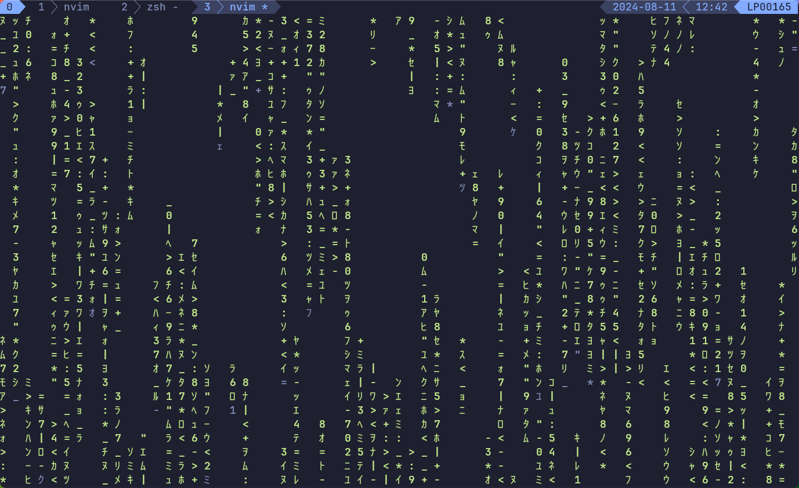
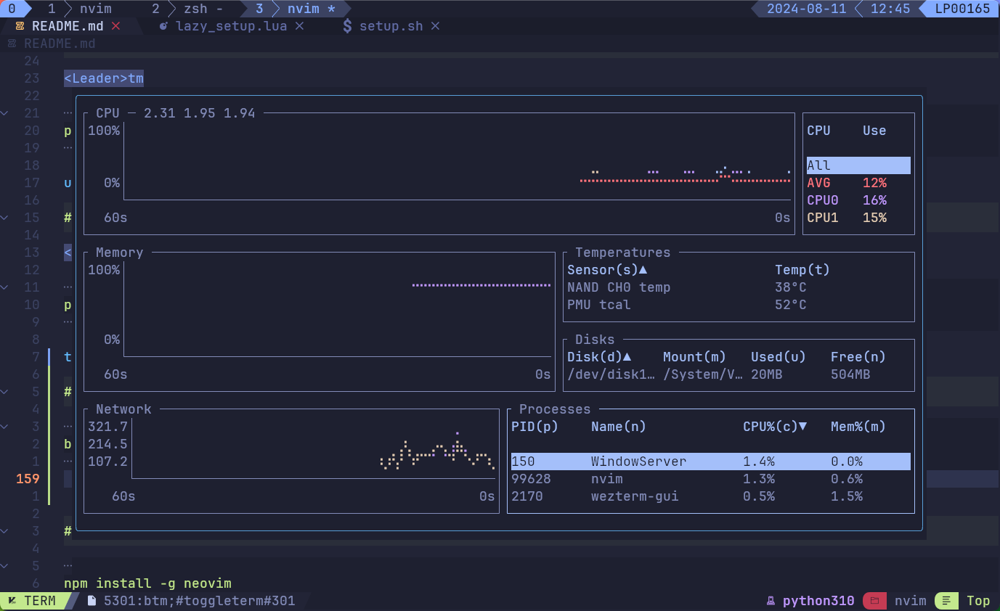

# AstroNvimV4 Config

**NOTE:** This is the latest v4 configuration.

In the course of my daily tasks, I have optimized my workflow by integrating several powerful tools. My terminal of choice is `WezTerm`, which offers a blend of performance and features that cater to my needs. Alongside this, I employ `tmux` to efficiently manage multiple terminal sessions within a single window.

Additionally, I utilize `yazi` as my terminal-based file manager, which seamlessly fits into my terminal-centric workflow. It is also worth noting that my configuration is compatible with `neovide`, eliminating the necessity for additional setups.

This streamlined combination of tools significantly enhances my productivity and provides a robust terminal experience.

#### TODO:

- [ ] Determine whether to load the plugin based on the language type.

## Support neovim version

neovim >= `0.10`, recommend `0.10.1`

## Features

now,this config supports development in `TypeScript`,`Python`,`Go`,`Rust` and `markdown`.

- **_`Typescript`_**: `vtsls` work with `volar2`
- **_`Python`_**: `basedpyright`
- **_`Go`_**: `gopher.nvim` _-- support go zero framework_
- **_`Markdown`_**: `iamcco/markdown-preview.nvim`,
- **_`Rust`_**: `mrcjkb/rustaceanvim`

## 🛠️ Installation

### The system should supports commands

`npm`,`rustc`,`go`,`tmux`

### Prepared install

```shell
brew install fzf
brew install fd
brew install luarocks
brew install lazygit
brew install ripgrep
npm install -g tree-sitter-cli
brew install gdu
brew install bottom
brew install protobuf
brew install gnu-sed
brew install mercurial
brew install ast-grep

pip install notebook nbclassic jupyter-console
pip install git+https://github.com/will8211/unimatrix.git
npm install -g neovim
pip install pynvim
pip install terminaltexteffects

brew tap daipeihust/tap
brew install im-select

brew install lazydocker
pip install pylatexenc

brew tap laishulu/macism
brew install macism
brew install imagemagick

npm i -g @styled/typescript-styled-plugin
```

### Install Astronvim

```shell
mv ~/.config/nvim ~/.config/nvim.bak
rm -rf ~/.local/share/nvim
rm -rf mv ~/.local/state/nvim
rm -rf mv ~/.cache/nvim

# clone code
git clone https://github.com/chaozwn/astronvim_with_coc_or_mason ~/.config/nvim
```

## workflow screenshot

`wezterm` + `tmux` + `astronvim`


`wezterm`


`tmux`


`yazi`


## other components config

`wezterm`: [https://github.com/chaozwn/wezterm]('https://github.com/chaozwn/wezterm')

`tmux`: [https://github.com/chaozwn/tmux]("https://github.com/chaozwn/tmux")

`yazi`: [https://github.com/chaozwn/yazi]("https://github.com/chaozwn/yazi")

### Note: for rust development

> rustup and mason's installation of rust-analzyer are different and may cause some [bugs](https://github.com/rust-lang/rust-analyzer/issues/17289), manual installation is recommended.

```shell
rustup component add rust-analyzer
```

## Tips

### NVcheatsheet

`<F2>`


### Use Lazygit

`<leader>tl`



### Install unimatrix

`<Leader>tm`

```shell
pip install git+https://github.com/will8211/unimatrix.git
```



### Install TTE

`<Leader>te`

```shell
pip install terminaltexteffects
```

https://github.com/user-attachments/assets/ff8aa481-932d-431c-b1a1-ea7cc6e63920

### Install Bottom

`<Leader>tt`

```shell
brew install bottom
```



### Neovim requirements

```shell
npm install -g neovim
pip install pynvim
```

### Markdown Image Paste

```shell
pip install pillow
```

### Input Auto Switch

```shell
brew tap daipeihust/tap
brew install im-select
im-select
```

run `im-select` & copy result to `im-select.lua`

```lua
return {
  "chaozwn/im-select.nvim",
  lazy = false,
  opts = {
    default_main_select = "com.sogou.inputmethod.sogou.pinyin", -- update your input method
    set_previous_events = { "InsertEnter", "FocusLost" },
  },
}
```

### Support for neovide

```shell
brew install neovide
neovide .
```

### Support Lazydocker

tigger command: `<leader>td`

```shell
brew install lazydocker
```

### Optional Input method

```shell
brew install --cask squirrel
```

## General Mappings

| Action                      | Mappings            |
| --------------------------- | ------------------- |
| Leader key                  | `Space`             |
| Resize up                   | `Ctrl + Up`         |
| Resize Down                 | `Ctrl + Down`       |
| Resize Left                 | `Ctrl + Left`       |
| Resize Right                | `Ctrl + Right`      |
| Up Window                   | `Ctrl + k`          |
| Down Window                 | `Ctrl + j`          |
| Left Window                 | `Ctrl + h`          |
| Right Window                | `Ctrl + l`          |
| Force Write                 | `Ctrl + s`          |
| Force Quit                  | `Ctrl + q`          |
| New File                    | `Leader + n`        |
| Close Buffer                | `Leader + c`        |
| Next Tab (real vim tab)     | `]t`                |
| Previous Tab (real vim tab) | `[t`                |
| Comment                     | `Leader + /`        |
| Horizontal Split            | `\`                 |
| Vertical Split              | <code>&#124;</code> |

## NOTE

### _vim.lsp.buf.hover()_ `KK` jump into signature help float window

> Displays hover information about the symbol under the cursor in a floating window. Calling the function twice will jump into the floating window.

### how to quickly set up a dap breakpoint

> use `<C-LeftClick>` in `line number`

### use kitty diff in .gitconfig

```
[core]
	autocrlf = input
[pull]
	rebase = true

[diff]
    tool = kitty
    guitool = kitty.gui

[difftool]
    prompt = false
    trustExitCode = true

[difftool "kitty"]
    cmd = kitty +kitten diff $LOCAL $REMOTE

[difftool "kitty.gui"]
    cmd = kitty kitty +kitten diff $LOCAL $REMOTE
```

